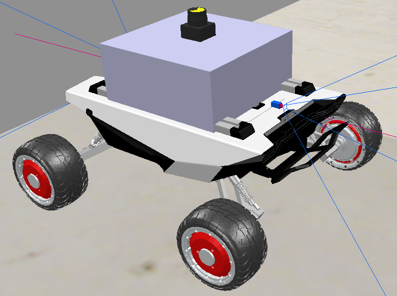

# 🤖 ISRLAB 2024 - Virtual Robotics Project

**Academic Year:** 2024/25  
**Course:** Intelligent Systems and Robotics Laboratory  
**Professor:** Giovanni De Gasperis
---

## 📘 Project Documentation

### 1. General Project Description
- **Title:** Scout-Mini: Visual and Lidar-Based Navigation
- **General Description:**  Simulation in CoppeliaSim of a 4-wheel robot (AgileX Scout-Mini) with differential drive, equipped with a 360° lidar, cameras and front/rear distance sensors. The goal is to navigate (avoiding collisions), detect and identify 3 cubes of different colors, and then generate a plan to reach (in randomly chosen order) the 3 detected cubes.

---

### 2. Simulated Robotic Platform

#### 2.1 Robot Model
- **Sensor Set:**  
  - Lidar: FastHokuyo (from the sensor library)
  - 2 Vision Sensors (prospective type) 
  - 2 Proximity Sensors (ray type)
- **Actuator Set:**  
  - 2 Proximity Sensors (ray type): they move to find the distance from the cubes once localized by the camera
  - 4 Revolute Joints: used to rotate the wheels
- **Body Description:** 
  - The robot was modified to simulate the physical version available in the lab, with the lidar raised (using a simple cuboid) by 15 cm.
  - More information on the original robot: https://global.agilex.ai/products/scout-mini
- **Simulated Robot Image:**
     

#### 2.2 Additional Details
- **Capabilities and Degrees of Freedom (DOF):** The robot can move only forward, backward and rotate on itself.
- **Other Information:** The lidar is placed higher than the vision and proximity sensors so that its beams do not intersect the cubes (which are lower than the lidar but higher than the sensors).

---

### 3. Simulation Environment
- **Simulator Used:**  CoppeliaSim  
- **Environment Configuration Details:** Simulation physics “Bullet 2.78”. The robot is placed on an infinite floor surrounded by walls where it must complete its task.

---

### 4. Definition of the Robot Objectives
- **Main Objective:**  Make contact with all three (can be changed) cubes present in the scene.  
- **Tasks to Perform:**  Explore and navigate the scene without collisions, find and precisely localize the cubes before reaching them.

---

### 5. Robot Agent Architecture
Follows the **Sense–Plan–Act** model.

- **Description of Each Module:**  
  1. **Sense Module:** divided into `SenseService` and `CameraService`, which respectively:  
     - **SenseService:** Collects lidar data, processes it and sends only essential information to the Controller (closest point and list of navigable gaps). Upon request from the Controller (after an objective has been generated), it combines the cube’s position with the lidar data to determine the best direction to move.
     - **CameraService:** Captures data from vision sensors, processes the images (using OpenCV) to find the cubes and identify their colors, and directly controls the proximity sensors to detect the cubes’ precise positions. The resulting cube positions are then sent to the Controller.
  2. **Plan Module:** Consists of the `Controller`, which manages setup, receives data from sensing modules, generates motion plans, decides (randomly) the task order, and sends movement commands to the `ActService`.
  3. **Act Module:** Consists of the `ActService`, which receives commands from the Controller and sets the target velocity of each wheel to perform the desired motion. It also manages speed control.
  4. **Support Modules:**  
     - **SimService:** Manages the simulation environment and keeps it running independently from the other modules.  
     - **SharedData:** Contains the shared memory manager for data exchange between processes.  
     - **Main:** Launches all processes and manages (non-functional) manual control input.

---

### 6. Dependencies
- ### Python Standard Library
  - math  
  - copy  
  - time  
  - traceback  
  - random  
  - multiprocessing (Process, Manager)

- ### Third-Party Libraries
  - CoppeliaSim ZMQ RemoteAPIClient  
  - numpy  
  - matplotlib  
  - opencv (cv2)  
  - scipy (spatial.cKDTree)  
  - pynput  

---

### 🧪 Installation and Testing
In the `scene` folder you can find everything needed for testing.  
You can use this preconfigured [Scene](scene/scene.ttt) for quick testing, or create a new one using the [Robot Model](scene/scout_mini_modified.ttm).  

Once you open CoppeliaSim, **do not** modify the names of the robot components.  
Then, open the [Main](controller/main.py) script and start the simulation.
